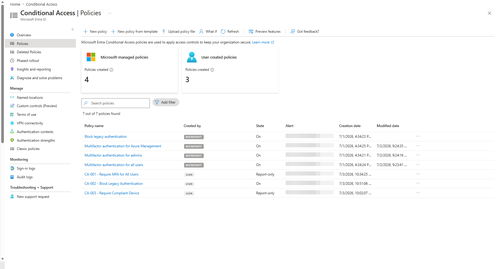
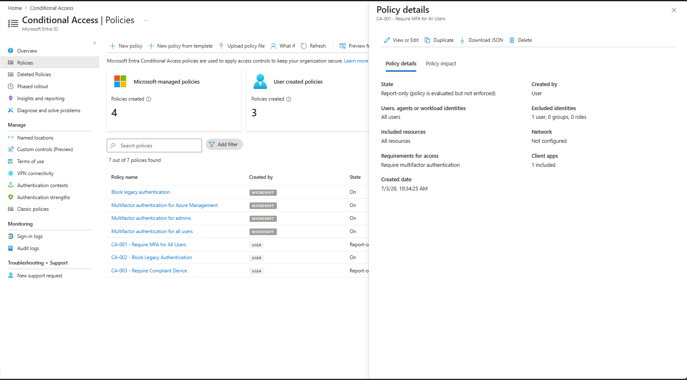
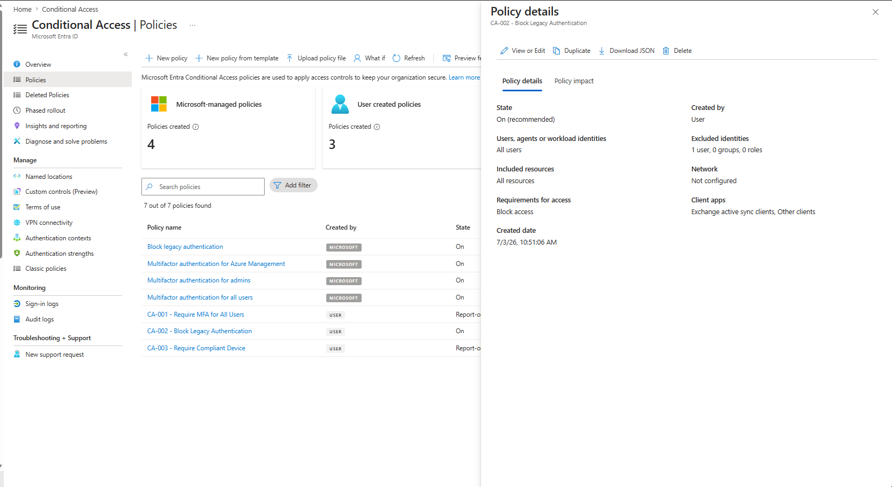
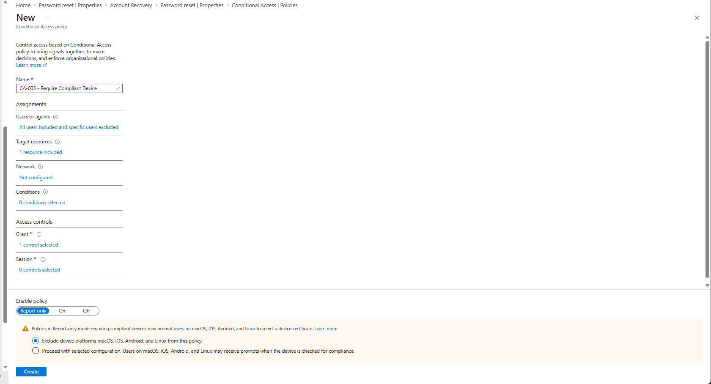

# Conditional Access Policies

## Overview

Conditional Access is the policy engine in Microsoft Entra ID that controls who can access what, from where, and under what conditions. It sits between the user and the resource — evaluating signals like user identity, device compliance, location, and risk level before granting access.

The break-glass emergency access account is excluded from every policy in this document. See [emergency-access-account.md](./emergency-access-account.md) for the reasoning.

*7 policies total as of July 2026: 4 Microsoft-managed (all On) + 3 user-created (CA-001 Report-only, CA-002 On, CA-003 Report-only)*

---

## Microsoft-Managed Policies (Auto-Created)

When Microsoft 365 Business Premium was provisioned, Microsoft automatically created four Conditional Access policies. These are active by default and cannot be deleted.

### 1. Multifactor authentication for all users

| Setting | Value |
|---------|-------|
| Created by | Microsoft |
| State | On |
| Included identities | All users |
| Excluded identities | Break-glass account |
| Cloud apps | All apps |
| Requirement | MFA |

Requires MFA for every user across all Microsoft cloud apps. Break-glass is excluded.

### 2. Multifactor authentication for admins

| Setting | Value |
|---------|-------|
| Created by | Microsoft |
| State | On |
| Included identities | All users with admin roles |
| Excluded identities | Break-glass account |
| Cloud apps | All apps |
| Requirement | MFA |

Targets accounts assigned admin roles with an additional MFA requirement. Break-glass holds Global Administrator but is excluded — consistent with emergency access design.

### 3. Multifactor authentication for Azure Management

| Setting | Value |
|---------|-------|
| Created by | Microsoft |
| State | On |
| Included identities | All users |
| Excluded identities | Break-glass account |
| Cloud apps | Azure portal, Entra admin center, Intune admin center |
| Requirement | MFA |

Specifically targets sign-ins to Azure management portals. Break-glass is excluded.

### 4. Block legacy authentication

| Setting | Value |
|---------|-------|
| Created by | Microsoft |
| State | On |
| Included identities | All users |
| Client apps | Exchange ActiveSync, Other clients (legacy auth protocols) |
| Grant | Block access |

Blocks all legacy authentication protocols. These protocols cannot enforce MFA, making them the most common vector for Microsoft 365 account takeovers.

---

## User-Created Policies

### CA-001 — Require MFA for All Users

| Setting | Value |
|---------|-------|
| Status | Report-only |
| Created | 3 July 2026, 10:34 AM |
| Users included | All users |
| Users excluded | Break-glass account |
| Target resources | All resources (all cloud apps) |
| Requirements for access | Require multifactor authentication |
| Client apps | 1 included (modern auth) |

> **Why create this when Microsoft already has an MFA policy?**
> The Microsoft-managed "Multifactor authentication for all users" policy is controlled by Microsoft and can be modified or removed by Microsoft at any time. CA-001 is an administrator-controlled duplicate that ensures MFA enforcement persists regardless of what happens to the Microsoft-managed version. It also gives full visibility and control over the policy conditions, exclusions, and grant requirements from within this tenant.

> **Why Report-only?**
> With MFA already enforced by the Microsoft-managed policy (currently On), setting CA-001 to Report-only allows evaluation of what this policy would affect without creating duplicate enforcement. Once the Microsoft-managed policies are reviewed and potentially disabled in favour of this user-controlled version, CA-001 will be switched to On.

> **Break-glass exclusion:**
> The break-glass account is excluded. A blanket MFA policy must always have an emergency bypass — if MFA infrastructure fails, the break-glass account provides a path back in.

---

### CA-002 — Block Legacy Authentication

| Setting | Value |
|---------|-------|
| Status | On |
| Created | 3 July 2026, 10:51 AM |
| Users included | All users |
| Users excluded | None (legacy auth blocked for everyone) |
| Target resources | All resources |
| Conditions — Client apps | Exchange ActiveSync clients, Other clients |
| Grant | Block access |

> **Why is this set to On immediately (not Report-only)?**
> Legacy authentication protocols — SMTP AUTH, POP3, IMAP, basic auth, Exchange ActiveSync — cannot enforce MFA. Any account using legacy auth is a credential-spray target. Microsoft already has a Block legacy authentication policy active on this tenant, so a second user-controlled policy set to On adds no additional lockout risk. All users in this environment authenticate through modern auth (browser, Microsoft 365 apps with OAuth). Blocking legacy auth immediately is zero-risk and closes a well-known attack vector.

> **Why no break-glass exclusion?**
> The break-glass account uses modern authentication (browser sign-in with MFA). Legacy auth exclusions serve no purpose here — if break-glass were using legacy auth, that itself would be a security problem. The policy is intentionally clean with no exclusions.

> **Why target Exchange ActiveSync and Other clients specifically?**
> Modern auth clients (Browser, Mobile apps and desktop clients using OAuth) must remain unblocked — those are the legitimate sign-in paths. Only legacy auth client types are targeted, so this policy has no impact on any user performing a normal sign-in.

---

### CA-003 — Require Compliant Device

| Setting | Value |
|---------|-------|
| Status | Report-only |
| Created | 3 July 2026, 10:02 AM |
| Users included | All users |
| Users excluded | Break-glass account |
| Target resources | Office 365 |
| Grant | Require device to be marked as compliant |
| Platform scope | Windows only (macOS, iOS, Android, Linux excluded) |

> **Why Report-only?**
> Intune device enrollment has not yet occurred. Turning this On before devices are enrolled and marked compliant would immediately block every user from Office 365. This policy switches to On in Phase 4 after all 11 machines are enrolled and compliance policies are configured.

> **Why Office 365 and not All cloud apps?**
> Scoping to Office 365 limits the blast radius during evaluation. Once device compliance is confirmed across the fleet, the scope will be widened.

> **Why are macOS, iOS, Android, and Linux excluded?**
> The IMS fleet is 11 Windows machines. No other platforms are enrolled in Intune. The exclusion prevents certificate prompts or unexpected blocks on those platforms if the policy is enabled before they are onboarded.

> **Break-glass exclusion:**
> Consistent with all other policies. A policy capable of blocking all users must always have a known-working emergency bypass.

---

### CA-004 — Sign-In Risk Block
- **Status:** Requires Entra ID P2 — not available on Business Premium
- Planned: Block access on high sign-in risk
- Will be documented here when licence is upgraded to P2

---

## Notes

**Security Defaults vs Conditional Access:** These cannot run simultaneously. When Microsoft-managed CA policies are active, Security Defaults are disabled. This tenant runs on Conditional Access.

**Policy order:** CA policies have no priority order — all matching policies are evaluated and the most restrictive result wins. An explicit Block always overrides a Grant.

**Testing approach:** New policies are created in Report-only mode first. This logs what would have been blocked without enforcing anything. Exception: CA-002 (Block Legacy Authentication) was set to On immediately because legacy auth is already blocked by a Microsoft-managed policy — zero additional risk.

---

*Last updated: July 2026*
