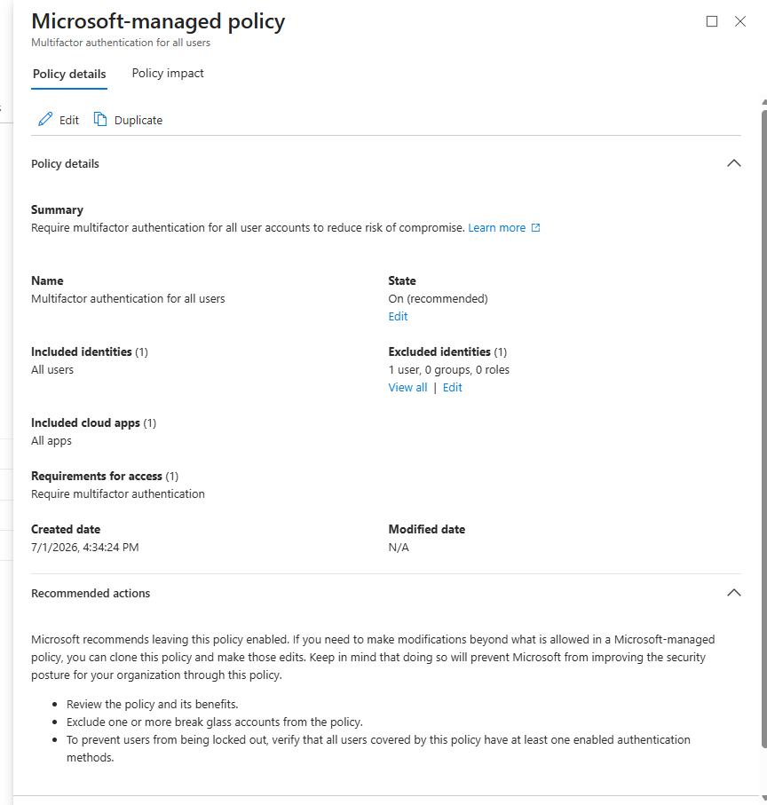
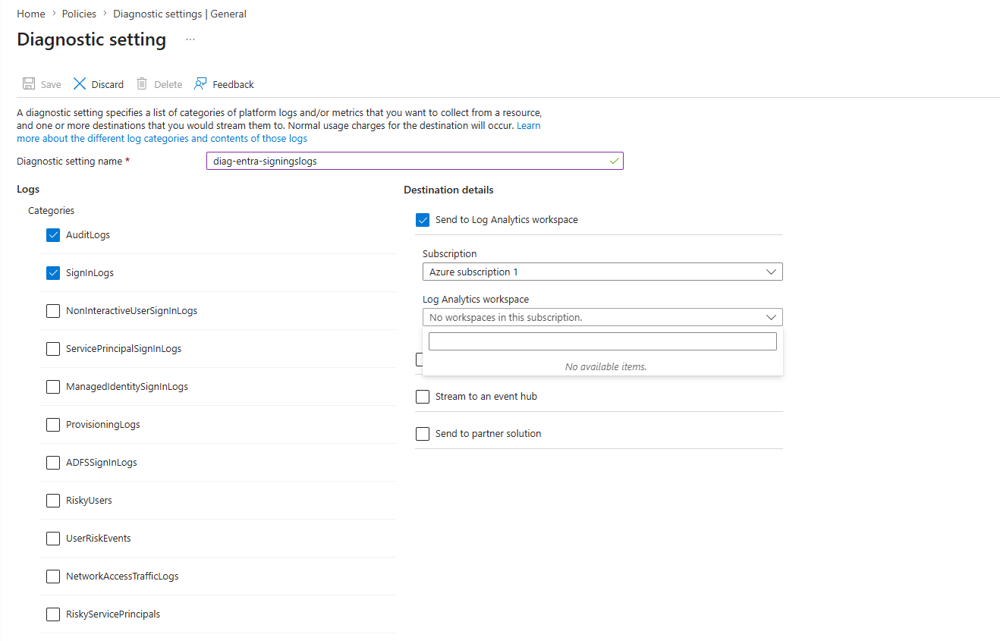
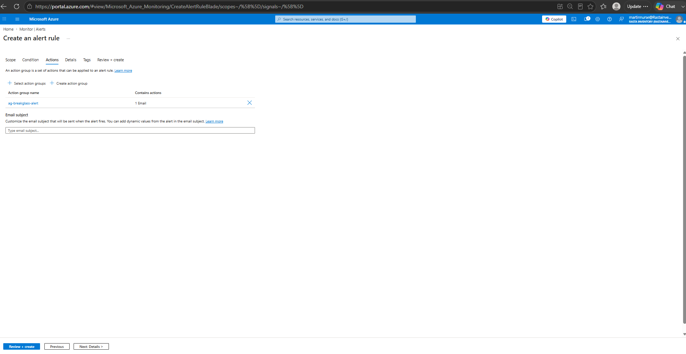
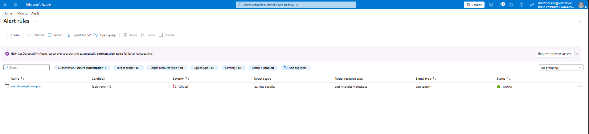

# Emergency Access Account (Break-Glass)

## Overview

An emergency access account is a cloud-only Global Administrator account used only when normal admin access is broken — for example, a misconfigured Conditional Access policy that locks out all administrators, or an MFA outage affecting the primary admin account.

Without this account, a lockout scenario requires calling Microsoft support. With it, access can be restored immediately without external dependency.

---

## What Was Configured

- **Account type:** Cloud-only (not synced from on-premises)
- **Role:** Global Administrator (permanent — PIM requires Entra ID P2, not available on Business Premium)
- **License:** None (unlicensed by design)
- **MFA:** Microsoft Authenticator app (lab workaround — see production note below)
- **Password:** Stored offline only — printed copy in a physically secured location

### Conditional Access Exclusions

The break-glass account is excluded from all Conditional Access policies. This is intentional and permanent. If a CA policy is the reason admins are locked out, the break-glass account must not be subject to that same policy — otherwise there is no recovery path.

*Verification Log — CA policy showing break-glass excluded (1 user excluded), State: On:*



> **Design Decision — Permanent CA Exclusion:** The break-glass account is the last line of defence against a CA misconfiguration lockout. If it were subject to the same policies as other accounts, a badly configured rule could lock it out simultaneously. The account is excluded from every policy created in this project — Microsoft-managed and user-created alike.

The account is excluded from the following policies (full policy details in [conditional-access-policies.md](./conditional-access-policies.md)):

| Policy | Type | Break-Glass Excluded |
|--------|------|---------------------|
| Multifactor authentication for all users | Microsoft-managed | Yes |
| Multifactor authentication for admins | Microsoft-managed | Yes |
| Multifactor authentication for Azure Management | Microsoft-managed | Yes |
| Block legacy authentication | Microsoft-managed | N/A — account uses modern auth only, so no exclusion is needed |

---

## Sign-In Monitoring

### Entra Diagnostic Settings

Sign-in logs are streamed from Entra ID to a Log Analytics workspace via diagnostic settings. This makes the logs available for KQL queries in Azure Monitor.

*Verification Log — Diagnostic setting configured with AuditLogs and SignInLogs streaming to Log Analytics workspace:*



> **Design Decision — AuditLogs + SignInLogs:** Both categories are collected. AuditLogs capture administrative changes (role assignments, policy modifications). SignInLogs capture authentication events. Together they provide full visibility of both what changed and who authenticated — the minimum baseline for security monitoring.

### Azure Monitor Alert Rule

An alert fires any time the break-glass account successfully signs in. The alert evaluates a KQL query against the Log Analytics workspace every 5 minutes.

*Verification Log — Action group configured with email notification (1 Email):*



*Verification Log — Alert rule confirmed Enabled, Severity 0 — Critical:*



> **Design Decision — Severity 0 Critical:** Any use of the break-glass account outside a declared emergency is a security event, not routine activity. Severity 0 ensures this alert is never treated as background noise. The action group triggers an immediate email so the sign-in is never missed regardless of who is monitoring.

**Alert details:**
- Name: `alert-breakglass-signin`
- Severity: 0 — Critical
- Target: `law-ims-security` (Log Analytics workspace)
- Signal: Custom log search (KQL)
- Evaluation frequency: Every 5 minutes

**KQL query:**
```kql
SigninLogs
| where UserPrincipalName == "[EMERGENCY-ACCOUNT-UPN]"
| where ResultType == 0  // 0 = successful sign-in
```

> Replace `[EMERGENCY-ACCOUNT-UPN]` with the actual UPN. Never publish real account usernames in a public repository.

---

## Production Notes

**MFA enforcement:** As of October 2024, Microsoft enforces MFA at the platform level for all sign-ins to the Azure portal, Entra admin center, and Intune admin center. This applies to all accounts including break-glass and cannot be bypassed by CA policy exclusions. The correct enterprise solution is a FIDO2 hardware security key (YubiKey) stored physically alongside the printed password — phone-independent and genuinely isolated from normal infrastructure. The lab registered Microsoft Authenticator as a workaround.

Reference: [Plan for mandatory Microsoft Entra MFA](https://learn.microsoft.com/en-us/entra/identity/authentication/concept-mandatory-multifactor-authentication)

---

## Operational Rules

- Never use this account for day-to-day administration
- Never store the password digitally — printed copy only, stored physically in a secure location
- Never add to any group or assign additional roles beyond Global Administrator
- Test sign-in successfully at least once every 90 days
- If used for any reason: rotate password immediately after and document the incident

---

*Last updated: July 2026*
