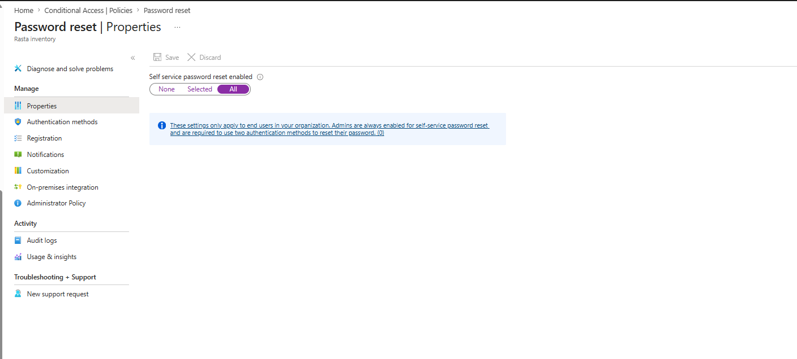
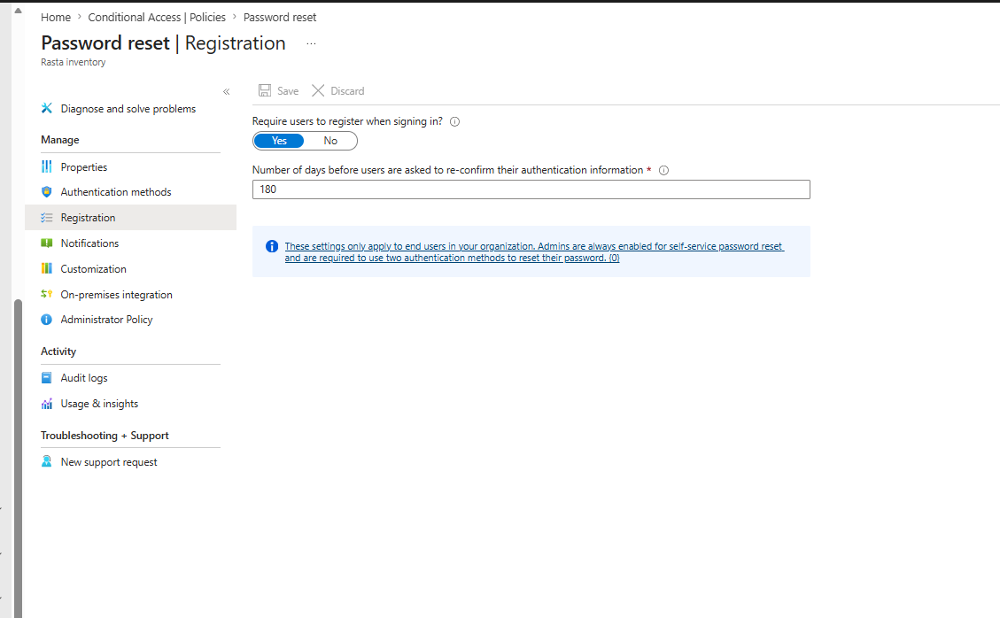
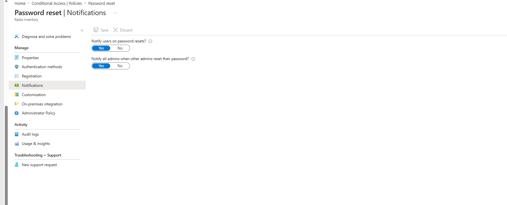
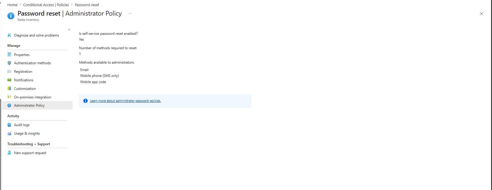

# Self-Service Password Reset (SSPR)

## Overview

Self-Service Password Reset allows users to reset their own passwords without calling the helpdesk. It reduces IT support overhead and gives users a secure, self-managed recovery path. SSPR is configured under Entra ID → Password reset.

---

## Properties

| Setting | Value |
|---------|-------|
| SSPR enabled | All users |
| Configured | 2 July 2026 |

> **Deviation: Scope set to All instead of a targeted group**
> The original plan was to target the three IMS security groups (`grp-ims-it-admins`, `grp-ims-supervisors`, `grp-ims-standard-users` - see [users-and-groups.md](./users-and-groups.md)). However, the SSPR Properties tab only accepts a single group. In a production environment the correct fix is to create a wrapper group containing all three groups and target that. For this lab tenant, with only 11 IMS users and a break-glass account - none of whom should be excluded from SSPR - setting scope to All is the practical equivalent. The break-glass account does not use SSPR; its password is stored offline.

---

## Authentication Methods

| Setting | Value |
|---------|-------|
| Number of methods required to reset | 1 |
| Security questions | Disabled |
| Other methods | Managed via central Authentication Methods Policy |

> **Why is this page mostly empty?**
> Microsoft moved authentication method management to the centralised Authentication Methods Policy (Entra ID → Protection → Authentication methods). Methods configured there - Microsoft Authenticator (mobile app notification and code) and Email OTP - apply automatically to SSPR. The SSPR Authentication methods tab now only exposes Security Questions as a legacy option. Security Questions are disabled here and are being retired by Microsoft in March 2027.

> **Why 1 method required?**
> Requiring 1 method is appropriate for end users in a small IMS environment. Admins are always required to use 2 methods regardless of this setting - that is enforced by the Administrator Policy tab (Microsoft-controlled, cannot be changed).

---

## Registration

| Setting | Value |
|---------|-------|
| Require users to register when signing in | Yes |
| Days before re-confirmation required | 180 |

> **Why require registration at sign-in?**
> Without enforced registration, users will not have authentication methods set up when they actually need to reset a password. Prompting at sign-in ensures every user registers their recovery method (Authenticator app or email) before they ever need it.

> **Why 180 days?**
> 180 days balances security with user friction. Users are reminded to verify their recovery methods are still valid every 6 months - frequent enough to catch changed phone numbers or email addresses, infrequent enough not to become noise.

---

## Notifications

| Setting | Value |
|---------|-------|
| Notify users on password resets | Yes |
| Notify all admins when other admins reset their password | Yes |

> **Why notify users on password reset?**
> If a user's password is reset without their knowledge - which could indicate account compromise or an unauthorised reset - they receive an immediate email alert. This gives the user a chance to contact IT before an attacker can do further damage.

> **Why notify admins when other admins reset their password?**
> Admin account password resets are high-risk events. Alerting all admins creates a peer-awareness mechanism - if one admin account is compromised and its password is reset by an attacker, other admins are immediately notified.

> **Deviation: Notifications tab initially failed to save**
> During initial SSPR configuration on 2 July 2026, clicking Save on the Notifications tab returned "Failed to save password reset policy - Unexpected error" repeatedly. The settings eventually saved on a subsequent attempt. This is a known intermittent Microsoft platform bug. The configuration is confirmed correct as of 3 July 2026.

---

## Customization

Not configured. No helpdesk URL or custom contact information has been set for this lab environment. In production, this would point to the IMS IT helpdesk contact.

---

## On-Premises Integration

Not applicable. This tenant is cloud-only - there is no on-premises Active Directory and no Azure AD Connect or Entra Connect Sync agent installed. Password writeback requires a sync agent and is irrelevant for a cloud-native deployment.

---

## Administrator Policy

| Setting | Value |
|---------|-------|
| SSPR enabled for admins | Yes |
| Methods required to reset | 1 |
| Methods available | Email, Mobile phone (SMS), Mobile app code |

> **This tab is read-only.** Microsoft enforces a separate, stricter password reset policy for all administrator accounts regardless of the user SSPR settings. Admins must use at least 2 authentication methods to reset their password. This cannot be changed by tenant administrators - it is a Microsoft security baseline applied to all Entra ID tenants.

---

## Summary

| Section | Status |
|---------|--------|
| Properties | All users enabled ✅ |
| Authentication methods | 1 method required, Security Questions disabled ✅ |
| Registration | Enforced at sign-in, 180-day re-confirmation ✅ |
| Notifications | User and admin notifications enabled ✅ |
| Customization | Not configured (lab environment) |
| On-premises integration | Not applicable (cloud-only) |
| Administrator Policy | Microsoft-managed, read-only ✅ |

---

*Last updated: July 2026*
