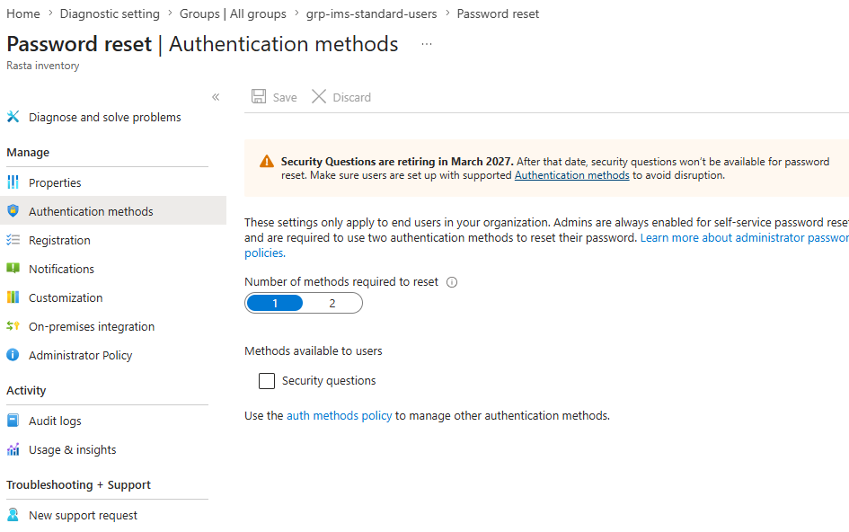

# Self-Service Password Reset (SSPR)

## Overview

Self-Service Password Reset allows users to reset their own passwords without contacting IT. For an 11-person organisation migrating to cloud identity, SSPR reduces helpdesk dependency and ensures users are not locked out when no administrator is available.

---

## Configuration

SSPR is configured in Entra ID at: Identity → Protection → Password reset.

### Properties

| Setting | Value |
|---------|-------|
| SSPR enabled for | All users |

> **Real-world deviation — Scope:** The SSPR Properties page only accepts a single group when using the "Selected" option. Since this is a dedicated lab tenant containing only IMS users, the scope was set to All rather than targeting each group individually. In a production tenant shared across departments, the correct approach would be to create a wrapper group (e.g. grp-ims-sspr-users) containing the three IMS groups, then target that single group. This would be documented as a Phase 2 refinement before production go-live.

### Authentication Methods

| Setting | Value |
|---------|-------|
| Number of methods required to reset | 1 |
| Security questions | Disabled (retiring March 2027) |
| Email, Authenticator app, Phone | Managed via central Authentication Methods Policy |

*Verification Log — SSPR authentication methods: 1 method required, security questions disabled:*

> **Design Decision — Central Authentication Methods Policy:** Microsoft has consolidated method configuration (email, authenticator, phone) into a single Authentication Methods Policy that governs both MFA and SSPR. The SSPR-specific Authentication methods tab now only shows Security Questions as a legacy option. This means the same method configuration applies consistently across both authentication scenarios — administrators manage it in one place instead of two.

### Registration

| Setting | Value |
|---------|-------|
| Require users to register on sign-in | Yes |
| Re-confirm authentication info after (days) | 180 |

Users will be prompted to register their reset methods the first time they sign in.

### Notifications

| Setting | Value |
|---------|-------|
| Notify users on password reset | Yes |
| Notify all admins when admins reset | Yes |

> **Real-world deviation — Notifications save failure:** The Notifications tab returned a persistent "Failed to save password reset policy — Unexpected error when saving password reset policy" on every save attempt. This is a known intermittent Entra ID issue unrelated to configuration. The Properties and Authentication Methods tabs saved successfully. Notifications settings will be retried in a future session.

---

*Last updated: July 2026*
