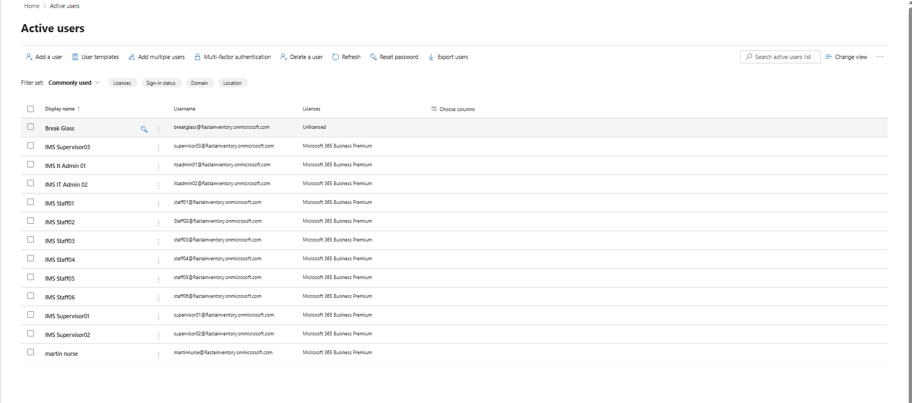
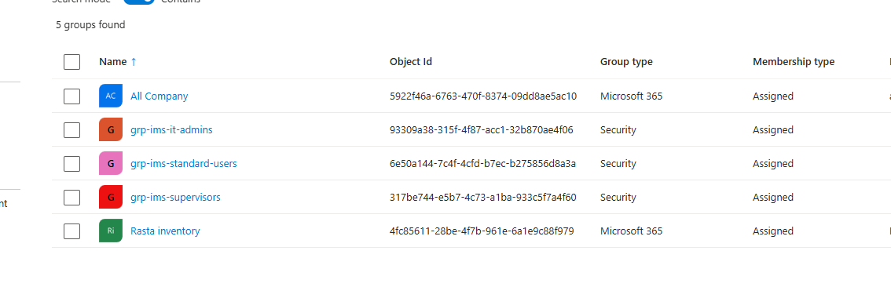
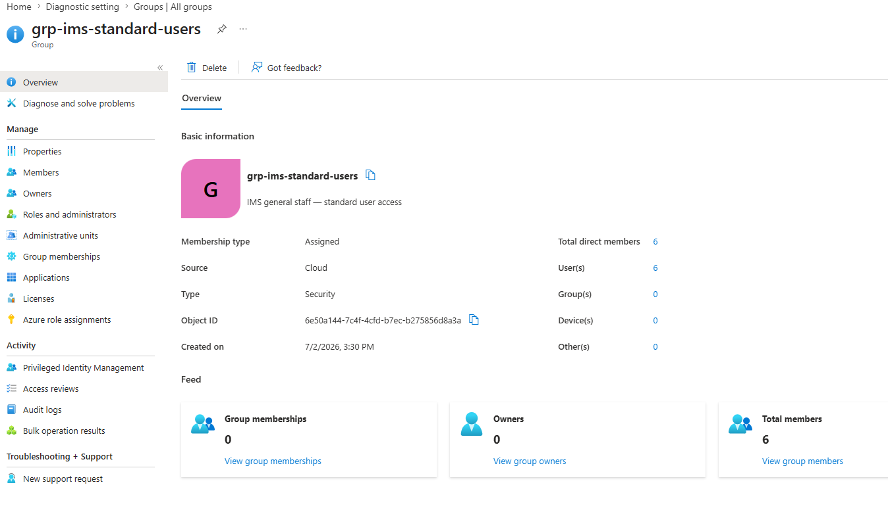

# Users and Security Groups

## Overview

Phase 2 of the IMS Azure migration required creating representative user accounts in Microsoft 365 and organising them into Entra ID security groups. These groups are the foundation for all policy targeting - Conditional Access, Intune device assignment, SSPR, and license management.

---

## User Accounts

Eleven accounts were created in Microsoft 365 Admin Center representing the IMS staff structure across three role tiers. All accounts were assigned Microsoft 365 Business Premium licenses and configured to require a password change on first sign-in.

| Role Tier | Count | Username Format |
|-----------|-------|----------------|
| IT Administrators | 2 | itsadmin01, itsadmin02 |
| Supervisors | 3 | supervisor01, supervisor02, supervisor03 |
| General Staff | 6 | staff01 through staff06 |

All accounts use placeholder display names and usernames. Real staff names exist only in the Microsoft 365 tenant and are not published in this repository.

*Verification Log - All 11 IMS accounts created and licensed with Microsoft 365 Business Premium:*

> **Design Decision - Placeholder Naming Convention:** Real personal names are not committed to a public repository. The placeholder naming (IMS Staff 01, IMS Supervisor 01, etc.) accurately represents the actual role structure and headcount of the IMS office without exposing personal information. When this project moves to production, real names and accounts will exist in the tenant while this repository retains placeholders.

---

## Security Groups

Three Entra ID security groups were created to segment users by role. Membership type is Assigned - users are added manually, not dynamically.

| Group Name | Type | Members | Intended Use |
|-----------|------|---------|--------------|
| grp-ims-it-admins | Security | 2 | Elevated access to Azure resources; admin policy targeting |
| grp-ims-supervisors | Security | 3 | Intermediate access; supervisor-specific policies |
| grp-ims-standard-users | Security | 6 | Restricted to approved applications; baseline policies |

These groups are the targeting foundation for [Conditional Access](./conditional-access-policies.md), [SSPR](./sspr.md), and upcoming Intune device assignment.

*Verification Log - Three IMS security groups confirmed in Entra ID All Groups:*

> **Design Decision - Role-Based Group Structure:** Targeting policies at named groups rather than all users provides granular control. IT admins require elevated access to Azure resources. Standard users should be restricted to approved applications only. Supervisors may have intermediate access requirements. Group-based targeting makes this differentiation possible and allows policies to be updated per role without affecting other groups.

### Group Membership Confirmation

*Verification Log - grp-ims-standard-users showing 6 direct members (Users: 6, Groups: 0, Devices: 0):*

---

*Last updated: July 2026*
