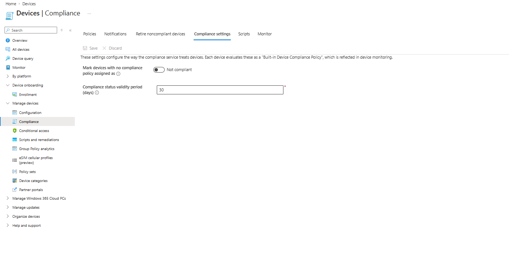
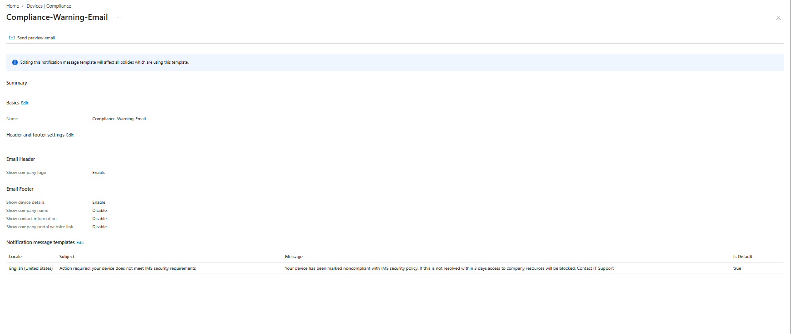
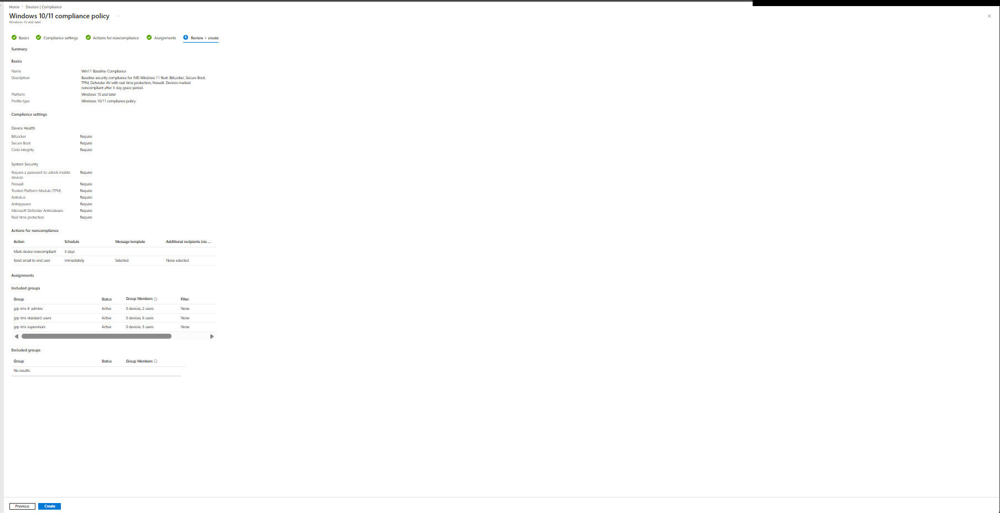

# Intune Compliance Policies

## Overview

Compliance policies define what a "healthy" device looks like; Conditional Access later enforces it by blocking noncompliant devices from company resources. This layer was built *before* any device enrolls, so that the first device to enroll is evaluated against a known baseline — enrolling first and configuring backward makes it impossible to tell which setting caused a compliance failure.

---

## Compliance Service Settings

Before creating any policy, the compliance service defaults were hardened.

| Setting | Default | Changed to |
|---------|---------|------------|
| Mark devices with no compliance policy assigned as | Compliant | **Not compliant** |
| Compliance status validity period (days) | 30 | 30 (unchanged) |

*Verification Log — compliance service settings hardened:*

> **Design Decision — No policy means noncompliant:** The tenant default treats a device with no compliance policy assigned as compliant. Combined with a "require compliant device" Conditional Access policy, that default is a hole: any device that slips through without a policy assignment gets a free pass to company resources. Flipping it to Not compliant closes the gap — no evaluation, no access. Changed while CA-003 is still in report-only mode, so no lockout risk.

---

## Noncompliance Notification Template

Template `Compliance-Warning-Email` created under Devices > Compliance > Notifications, used by the baseline policy's email action.

| Element | Value |
|---------|-------|
| Subject | Action required: your device does not meet IMS security requirements |
| Message | Device marked noncompliant; 3 days to resolve before access is blocked; contact IT support |
| Footer | Device details enabled; company name/contact/portal link disabled (tenant branding not configured) |

*Verification Log — notification template created:*

---

## Win11-Baseline-Compliance Policy

Platform: Windows 10 and later · Profile type: Windows 10/11 compliance policy

### Compliance settings

| Category | Setting | Value |
|----------|---------|-------|
| Device Health | BitLocker | Require |
| Device Health | Secure Boot | Require |
| Device Health | Code integrity | Require |
| System Security | Password to unlock device | Require |
| System Security | Firewall | Require |
| System Security | Trusted Platform Module (TPM) | Require |
| System Security | Antivirus | Require |
| System Security | Antispyware | Require |
| System Security | Microsoft Defender Antimalware | Require |
| System Security | Real-time protection | Require |

### Actions for noncompliance

| Action | Schedule |
|--------|----------|
| Send email to end user (`Compliance-Warning-Email`) | Immediately |
| Mark device noncompliant | 3 days |

### Assignments

Included groups: `grp-ims-it-admins` (2 users), `grp-ims-supervisors` (3 users), `grp-ims-standard-users` (6 users) — all 11 fleet users.

*Verification Log — policy summary at creation:*

> **Design Decision — 3-day grace period, warn first:** The user is emailed the day the device falls out of compliance and has 3 days to remediate before the device is marked noncompliant (and, once CA enforcement is on, blocked). Warning before punishment fits an 11-person office; immediate lockout generates support calls, not security.

> **Design Decision — No password complexity/expiration rules:** Minimum length, expiration, and password-history settings were deliberately left unconfigured. Forced password rotation is a retired practice (users increment `Password1` → `Password2`); credential security in this design comes from enforced MFA and Windows Hello for Business, not rotation. The policy only requires that a password exists to unlock the device.

> **Design Decision — Minimum OS version deferred:** Left unset until the first device enrolls and the actual Windows 11 build is confirmed. Setting a minimum above the deployed build would instantly mark every device noncompliant and create a false troubleshooting trail.

> **Design Decision — Assigned to the three fleet groups, not "All users":** All-users assignment would sweep in the tenant admin and the break-glass emergency account. The break-glass account must remain outside all compliance and Conditional Access enforcement — same exclusion principle documented in `../entra-id/emergency-access-account.md`.

---

## Next

Configuration profiles — BitLocker settings, Windows Hello for Business, and a Windows Update ring.

---

*Last updated: July 2026*
