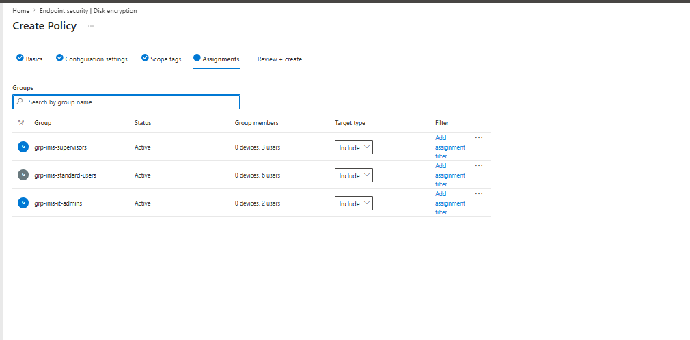
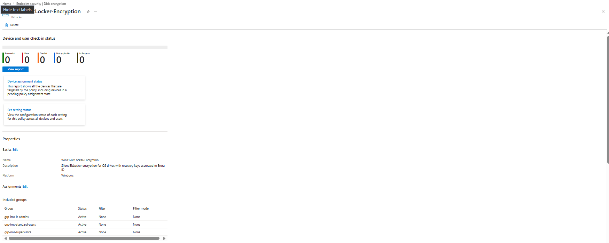
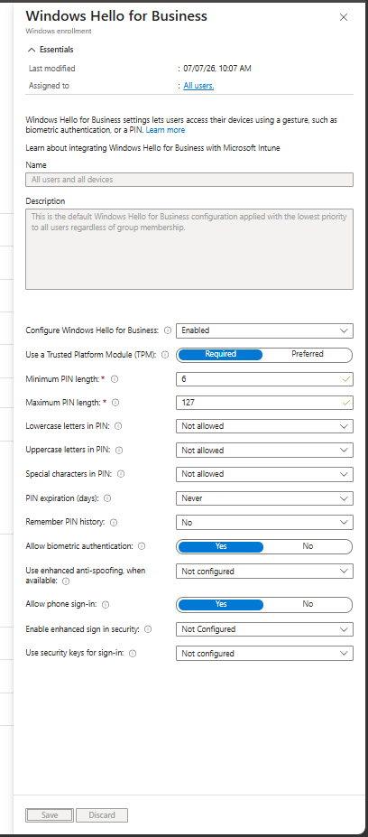
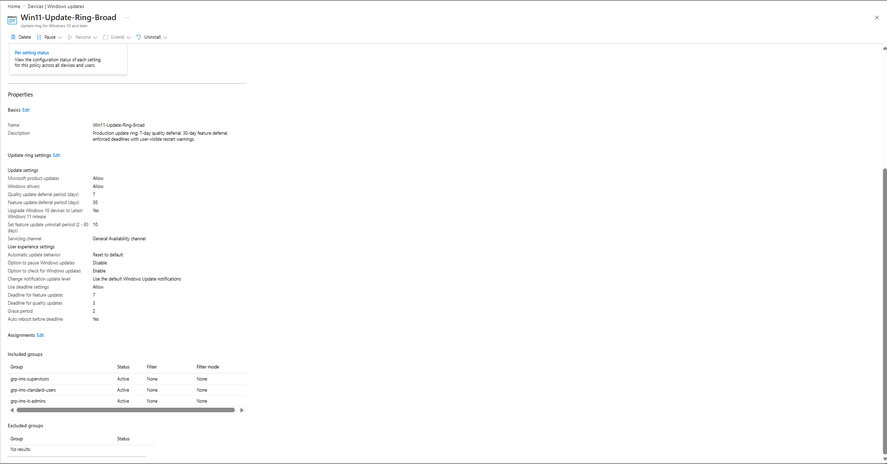

# Intune Configuration Profiles

## Overview

The compliance policy (`Win11-Baseline-Compliance`) defines what a healthy device looks like; these profiles are what *make* devices healthy. A device that enrolls with only the compliance policy assigned would sit noncompliant with no remediation path — the policy checks BitLocker, but nothing turns BitLocker on. Each profile below maps directly to a compliance requirement.

| Profile | Enforces | Satisfies compliance check |
|---------|----------|---------------------------|
| Win11-BitLocker-Encryption | Silent full-disk encryption, keys escrowed to Entra ID | BitLocker: Require |
| Windows Hello for Business | Passwordless sign-in (PIN + biometrics backed by TPM) | Password to unlock: Require |
| Update ring | Windows Update for Business deferral/deadline policy | (Replaces manual Ansible update scheduling) |

---

## Win11-BitLocker-Encryption

Endpoint security > Disk encryption > BitLocker · Platform: Windows

### Base settings

| Setting | Value |
|---------|-------|
| Require Device Encryption | Enabled |
| Allow Warning For Other Disk Encryption | **Disabled** — this is what makes encryption silent |
| Allow Standard User Encryption | Enabled |

*Verification Log — base settings:*

### OS drive recovery settings

| Setting | Value |
|---------|-------|
| Choose how BitLocker-protected OS drives can be recovered | Enabled |
| Save recovery information to AD DS / Entra ID | True |
| Do not enable BitLocker until recovery information is stored | **True** |
| Configure user storage of recovery information | Require 48-digit recovery password |
| Configure storage of recovery information | Store recovery passwords only |
| Omit recovery options from the BitLocker setup wizard | True |
| Fixed / Removable data drives | Not configured |

*Verification Log — recovery and escrow settings:*

### Assignments

Included groups: `grp-ims-it-admins`, `grp-ims-supervisors`, `grp-ims-standard-users` — same three groups as the compliance policy.

*Verification Log — assignments and created policy:*

> **Design Decision — Silent encryption:** With "Allow Warning For Other Disk Encryption" disabled, encryption starts without any user prompt. Users never see, print, or handle a recovery key. Under the old Ansible setup, disk encryption depended on per-machine manual setup; here it is a background consequence of enrollment.

> **Design Decision — Escrow before encryption:** "Do not enable BitLocker until recovery information is stored" set to True means a recovery key exists in Entra ID *before* the disk is encrypted. The failure mode this prevents: a disk encrypted with a key that was never successfully backed up — an unrecoverable device. IT retrieves keys from Entra ID (device object > Recovery keys); users are never a link in the key-management chain.

> **Design Decision — OS drives only:** Fixed and removable data drive encryption left unconfigured. Fleet data lives on OS drives and SharePoint/OneDrive; removable-media policy is a decision for the production migration, not this build.

---

## Windows Hello for Business

Devices > Enrollment > Windows > Windows Hello for Business (tenant-wide enrollment policy, applies to all users at enrollment)

| Setting | Value |
|---------|-------|
| Configure Windows Hello for Business | Enabled |
| Use a Trusted Platform Module (TPM) | **Required** |
| Minimum PIN length | 6 |
| Lowercase / uppercase / special characters in PIN | Not allowed (numeric-only) |
| PIN expiration | Never |
| Remember PIN history | No |
| Allow biometric authentication | Yes |
| Phone sign-in | Yes |
| Enhanced anti-spoofing / security keys | Not configured |

*Verification Log — Windows Hello for Business enrollment policy:*

> **Design Decision — Numeric PIN, no complexity, no expiration:** A Hello PIN is not a password — it never leaves the device and is backed by TPM anti-hammering, so a 6-digit numeric PIN with no rotation beats a complex password typed where anyone can watch. PIN complexity and expiration rules are the same retired thinking as password rotation, deliberately excluded — consistent with the compliance policy's password decisions.

> **Design Decision — TPM Required, not Preferred:** Required means enrollment of Hello credentials fails on hardware without a TPM rather than silently falling back to software key storage. The Gen2 VMs' vTPM satisfies this; biometrics become meaningful when the policy carries over to physical hardware in the production migration.

> **Phase 4 consequence:** Every device's OOBE ends with mandatory PIN setup for the enrolling user — this is the "Require a password to unlock" compliance check being satisfied at enrollment time, not after.

---

## Win11-Update-Ring-Broad

Devices > Manage updates > Windows updates > Update rings · replaces the manual Ansible update scheduling from the legacy setup

### Update settings

| Setting | Value |
|---------|-------|
| Microsoft product updates / Windows drivers | Allow |
| Quality update deferral | 7 days |
| Feature update deferral | 30 days |
| Upgrade Windows 10 to latest Windows 11 | Yes |
| Feature update uninstall period | 10 days |
| Pre-release builds | Not configured |

### User experience

| Setting | Value |
|---------|-------|
| Automatic update behavior | Reset to default |
| Option to pause Windows updates | **Disable** |
| Option to check for updates | Enable |
| Use deadline settings | Allow |
| Deadline: quality 3 days · feature 7 days · grace 2 days | — |
| Auto reboot before deadline | Yes |

*Verification Log — update ring settings:*

### Assignments

Same three fleet groups as all other policies.

> **Design Decision — 7-day quality deferral:** Patches land a week after Patch Tuesday — long enough for Microsoft to pull a broken update, short enough to stay within any reasonable patching SLA. Feature updates wait 30 days for ecosystem shakeout.

> **Design Decision — Users cannot pause updates:** With pause enabled, any user can postpone security patches up to 35 days from Settings, silently defeating the deadline enforcement. Pausing is an IT decision made at the ring level in the console, not a per-user choice. Combined with deadlines (3/7 days + 2-day grace, auto reboot), updates are guaranteed-eventual rather than best-effort — the property the old Ansible setup could only deliver for machines that happened to be on the office network.

---

*Last updated: July 2026*
