# Device Enrollment - Autopilot Pilot (Phase 4)

## Overview

Phase 4 enrolls the fleet through Windows Autopilot: hardware hash registration → dynamic group membership → deployment profile → user-driven OOBE enrollment. This document covers the pilot device (VM-STAFF01, enrolled as staff01) - proving the full chain end-to-end before batch-enrolling the remaining 10 devices. The pilot surfaced two real failures, documented in the Troubleshooting section; that is what pilots are for.

## Test Environment

The deployment is validated on VMware Workstation Pro VMs before touching production hardware - the same pilot-then-production sequencing the real migration will follow.

| Component | Value | Why |
|-----------|-------|-----|
| Hypervisor | VMware Workstation Pro (free personal license) | Host runs Windows Home (no Hyper-V); Workstation provides full vTPM |
| VM firmware | UEFI + Secure Boot enabled | Compliance policy requires Secure Boot |
| vTPM | TPM 2.0 (VM encryption enabled) | Satisfies TPM + BitLocker requirements; Intune reports it as `TPM 2.0, VMW` |
| Guest OS | Windows 11 Pro (Home cannot Entra-join) | Matches target fleet |
| Sizing | 2 vCPU / 4-8 GB RAM / 60 GB disk | One VM per fleet user, run in batches |

> **Design Decision - VMs as pilot, not pretend hardware:** The Intune/Entra backend is identical regardless of what the endpoint runs on. Everything above the hardware - enrollment, policy, compliance, encryption, Conditional Access - is the real production configuration. What VMs cannot validate (user communication, change windows, physical rollout logistics) is explicitly out of scope for the pilot.

---

## Hardware Hash Registration

From the parked OOBE screen (Shift+F10 → PowerShell), each device registers itself with the `IMS-Fleet` group tag:

```powershell
Set-ExecutionPolicy -Scope Process -ExecutionPolicy Bypass -Force
Install-Script -Name Get-WindowsAutoPilotInfo -Force
Get-WindowsAutoPilotInfo.ps1 -Online -GroupTag "IMS-Fleet"
```

Sign-in uses the tenant admin account; the first run requires admin consent for the Autopilot Graph app. Import takes ~2 minutes per device.

*Verification Log - hash imported and synced:*

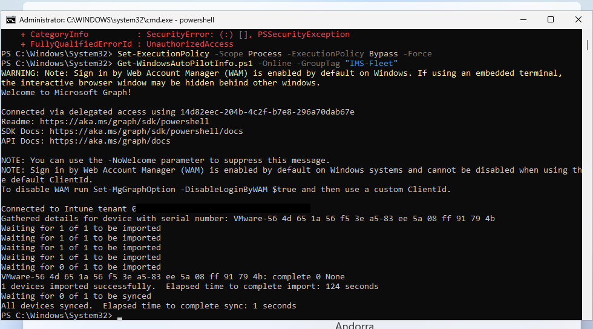

> **Field note:** `-Scope Process` means the execution-policy bypass dies with the PowerShell session - a second session needs the command re-run. The first attempt here failed with `PSSecurityException` for exactly that reason.

---

## Autopilot Plumbing

Three objects connect the group tag to an enrollment experience:

| Object | Name | Key setting |
|--------|------|-------------|
| Dynamic device group | `grp-ims-autopilot-devices` | `(device.devicePhysicalIds -any (_ -eq "[OrderID]:IMS-Fleet"))` |
| Deployment profile | `IMS-UserDriven-EntraJoin` | User-driven, Entra joined, **user account type: Standard**, name template `IMS-%RAND:5%` |
| Enrollment Status Page | Default | Progress shown, 60-min timeout, device not blocked on apps |

*Verification Log - group, ESP, and profile assignment:*

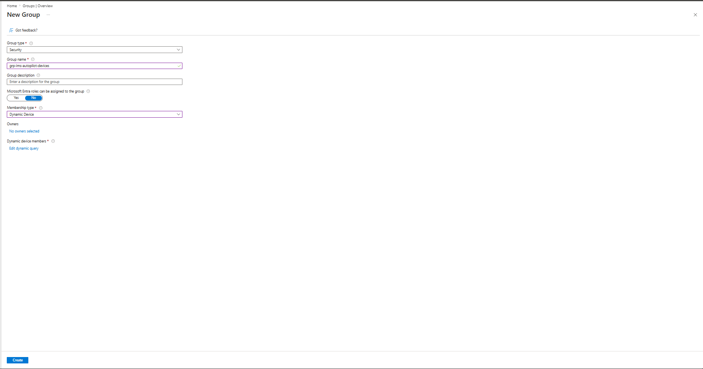

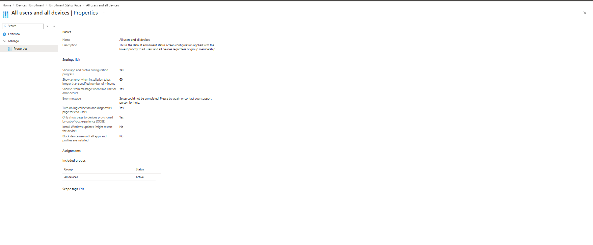

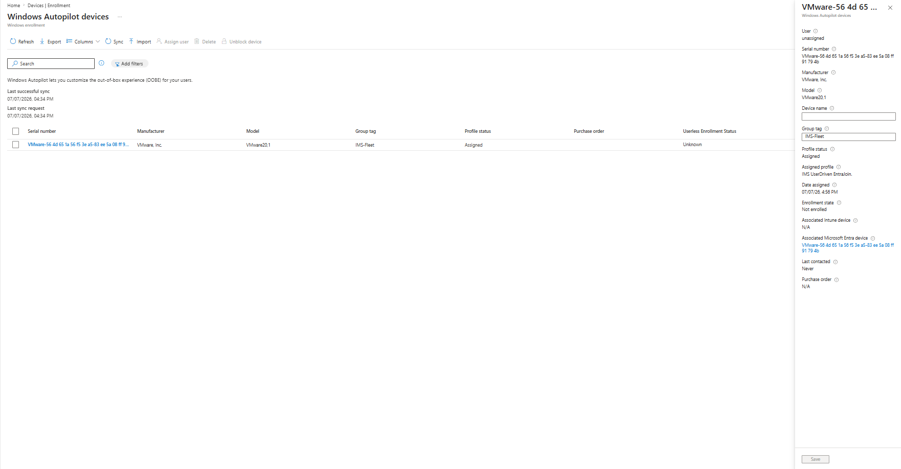

> **Design Decision - Standard user, not admin:** The deployment profile makes the enrolling user a standard user. Under the legacy setup every user ran with local admin; this single setting removes that entire risk class at enrollment time.

> **Design Decision - group tag as the only hook:** Every downstream behaviour (group membership → profile → policies) derives from the `IMS-Fleet` tag set at hash import. Onboarding device #2 through #11 requires zero additional portal configuration - the definition of the Autopilot value proposition versus the 6-playbook manual onboarding it replaces.

> **Field note - propagation delay:** Profile status sat at "Pending" for ~20 minutes after import before flipping to "Assigned." This is normal Autopilot behaviour, not a fault; the device must not begin OOBE enrollment until status reads Assigned.

---

## Pilot Enrollment (VM-STAFF01 → staff01)

User-driven flow as experienced by the end user: OOBE → organization sign-in → temp password change → MFA registration → ESP provisioning → mandatory Hello PIN → desktop. Device named `IMS-38106` by the profile's naming template; staff01 attached as primary user; ownership Corporate.

*Verification Log - enrollment sequence:*

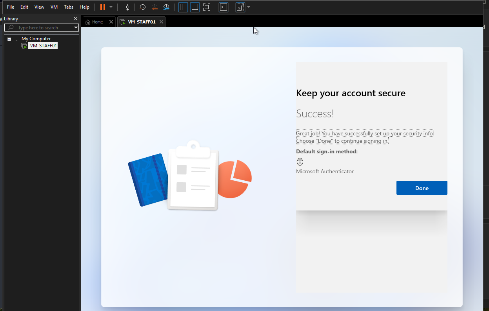

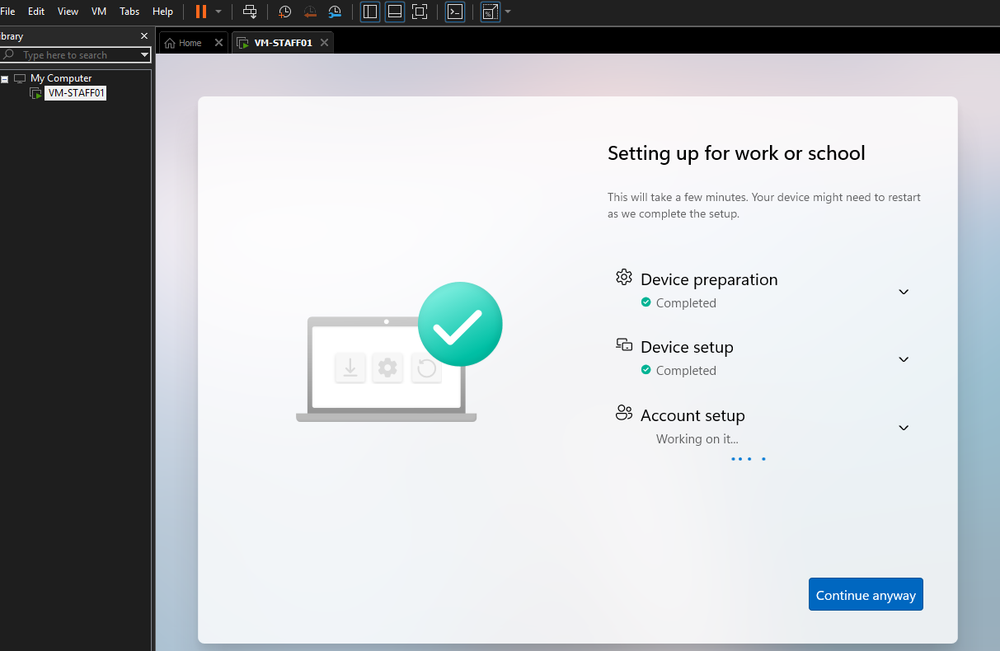

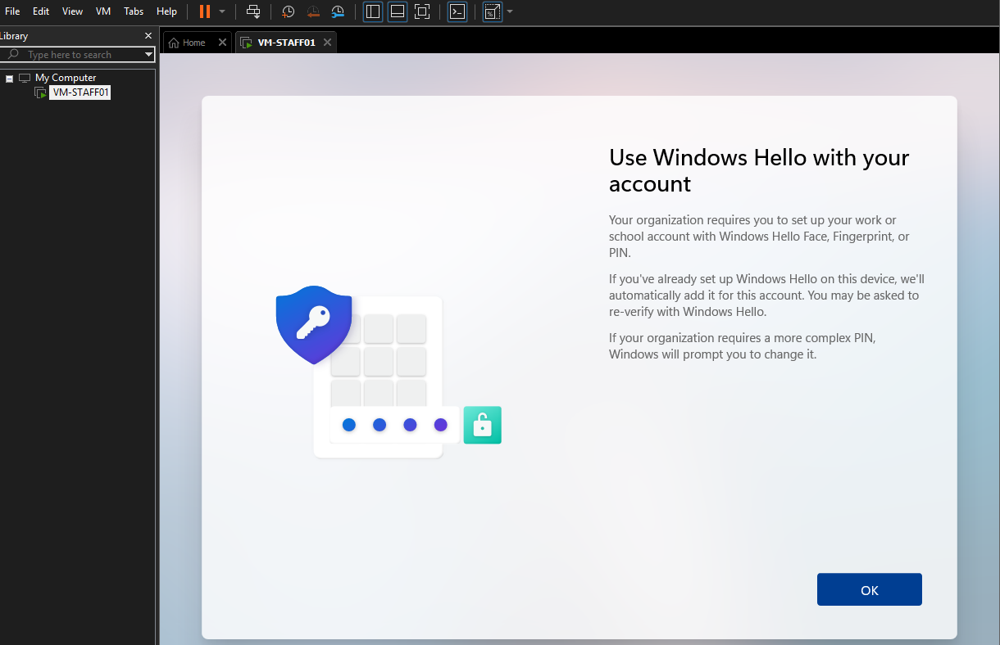

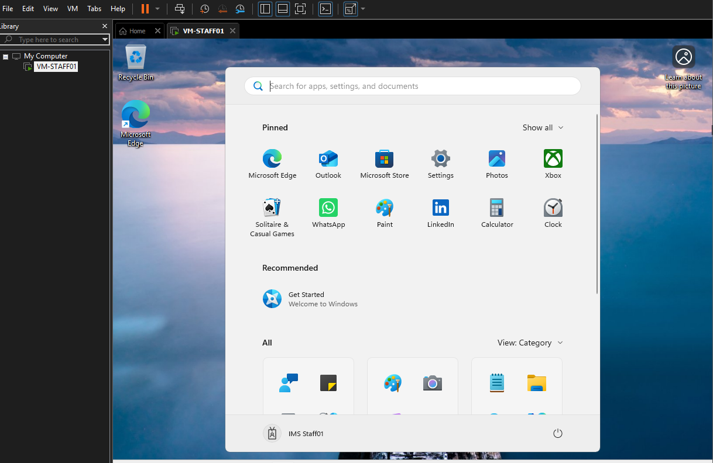

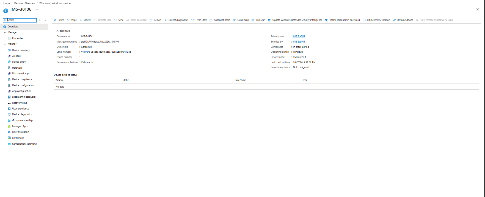

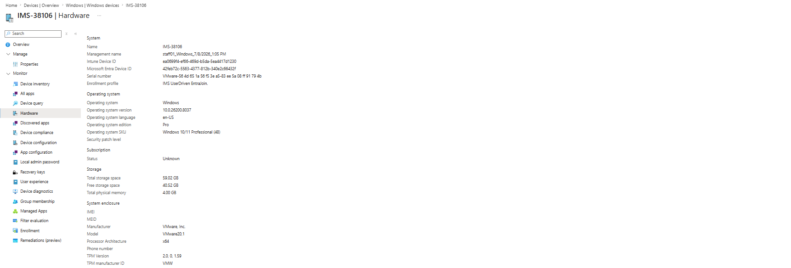

> **Field note - SSPR used in production:** The tenant admin password was reset mid-phase via self-service password reset - the SSPR deployment from Phase 2 doing its job for its own administrator.

With the first device's build number known (10.0.26200.8037), the compliance policy's deferred minimum OS version was set:

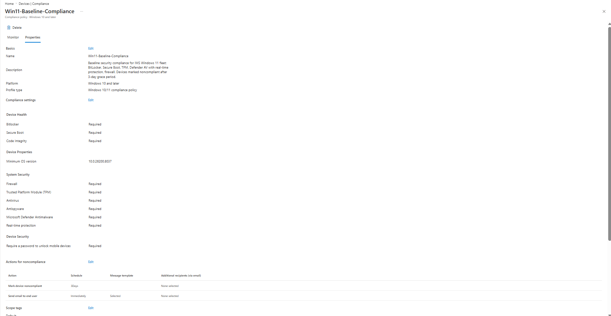

---

## Troubleshooting Log

The pilot device landed in the compliance grace period with two failing checks - BitLocker and Secure Boot:

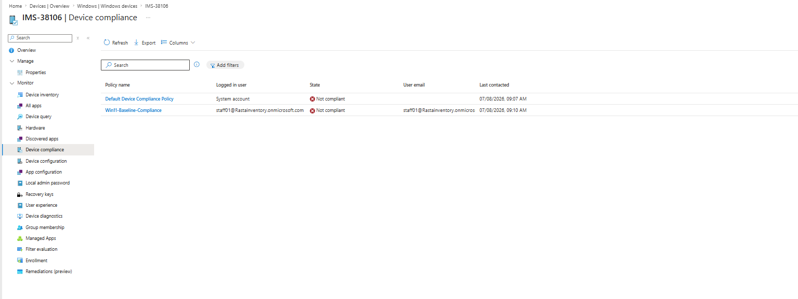

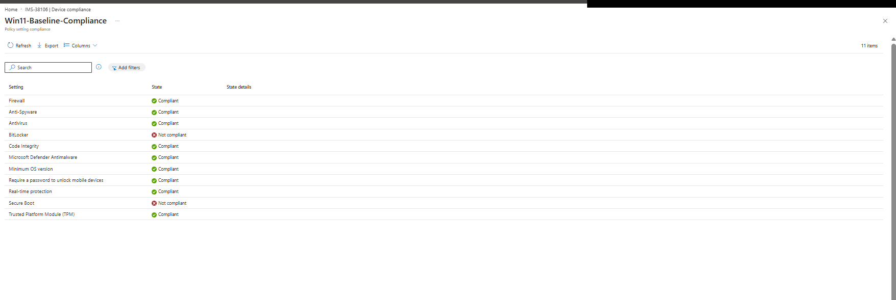

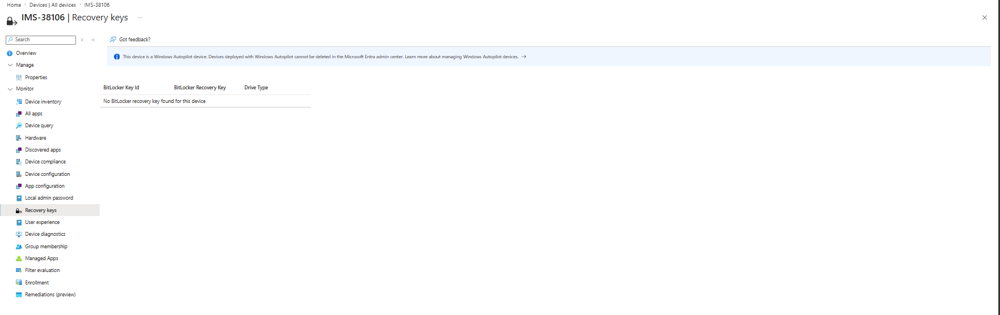

**Diagnosis:** BitLocker-API event log on the device (Event ID 853):

> *"Failed to enable Silent Encryption. TPM is not available. Error: BitLocker Drive Encryption detected bootable media (CD or DVD) in the computer. Remove the media and restart the computer before configuring BitLocker."*

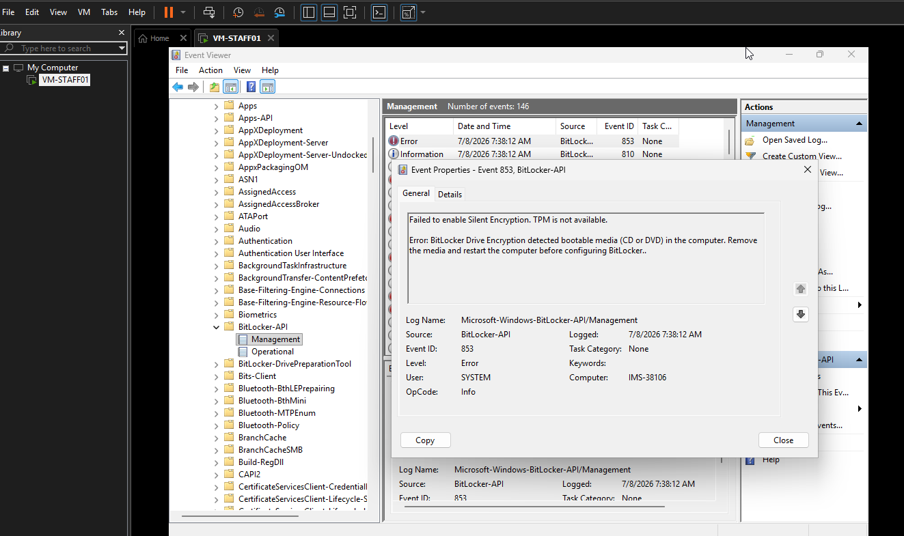

**Root cause:** the Windows 11 installation ISO was still attached to the VM's virtual DVD drive. BitLocker refuses silent encryption while bootable media is present. The Secure Boot failure was stale device-health attestation from the same blocked evaluation cycle - the VM's firmware had Secure Boot enabled throughout.

**Remediation:** disconnect the virtual DVD (both "Connected" and "Connect at power on"), verify Secure Boot in VM firmware settings, reboot, force an Intune sync:

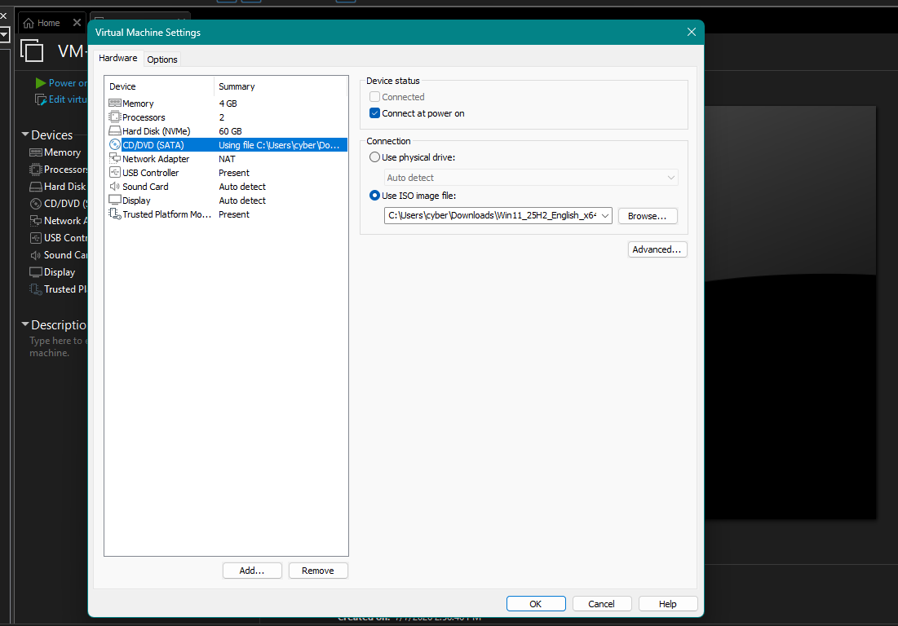

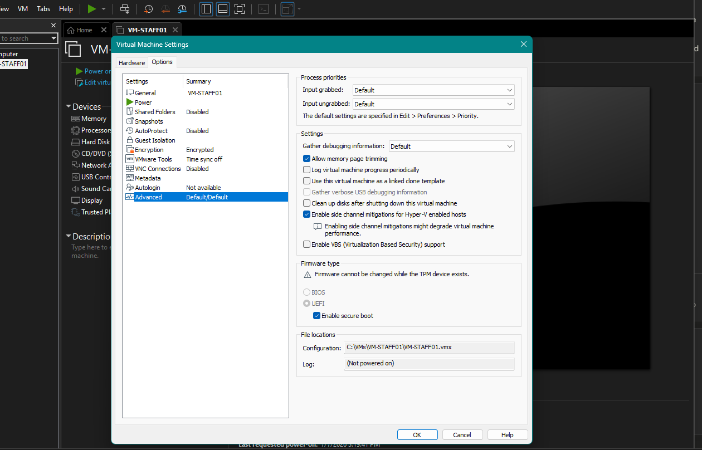

**Resolution:** within one restart-and-sync cycle of removing the virtual DVD, silent encryption started and the 48-digit recovery key appeared in Entra ID - key escrowed *before* the disk finished encrypting, exactly as the escrow-before-encrypt policy requires. No user action, no visible prompts.

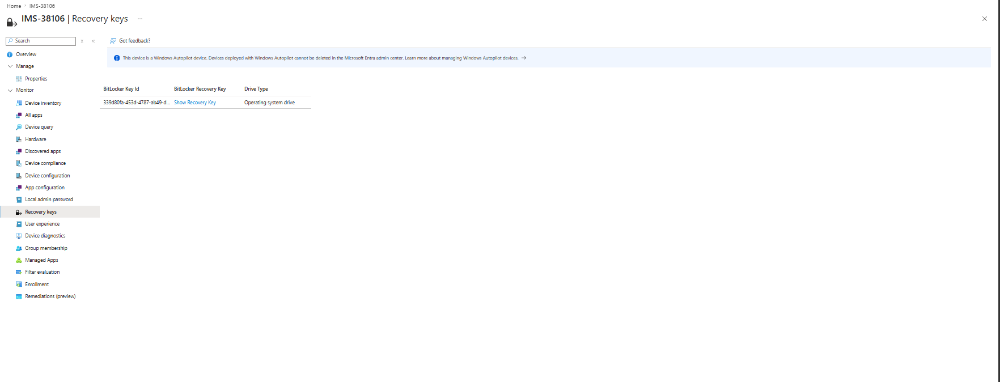

**Process change for the batch:** the fleet build checklist now disconnects the ISO immediately after Windows installation, before OOBE. The failure class is eliminated for devices 2-11.

**Final state:** after the next attestation cycle, all 11 compliance checks report Compliant - BitLocker and Secure Boot included. The pilot device went enrolled → grace period → diagnosed → remediated → compliant without any manual encryption steps on the device itself.

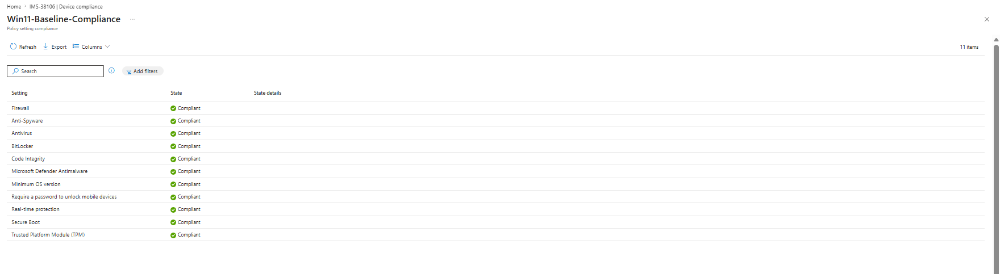

---

## Rebuild Note (VM-STAFF01 rebuilt as IMS-65395)

After the pilot completed, VM-STAFF01 stopped booting: the guest boot files were corrupted by repeated virtual-CPU faults in the lab hypervisor, producing a deterministic triple fault a fraction of a second into the Windows Boot Manager handoff. Rather than attempt a fragile WinRE recovery of a BitLocker-locked volume, the VM was wiped and reinstalled in place.

Because Autopilot registration is keyed to the hardware serial rather than the OS install, no re-registration was needed. The rebuilt VM kept its serial, matched the existing Autopilot record, and re-ran the `IMS-UserDriven-EntraJoin` profile automatically. The only manual cleanup was deleting the stale Intune device object (`IMS-38106`) so the fresh enrollment would not collide with it.

The device re-enrolled hands-off as `IMS-65395`, silent BitLocker encryption ran clean (ISO disconnected before OOBE, per the batch checklist), and it returned to fully Compliant on the first evaluation cycle - no Event 853 recurrence.

> **Design Decision - rebuild over repair:** With the compliance evidence and full troubleshooting log already captured on IMS-38106, a booting copy of that exact device object added no portfolio value. A clean rebuild was faster and more reliable than repairing corrupted boot files, and it doubled as the first live run of the batch onboarding procedure. Any one of the fleet VMs can serve as the surviving compliant demo device.

> **Field note - Autopilot idempotency:** Wipe-and-re-enroll cost zero reconfiguration. The group tag on the hardware hash drove group membership, profile, and every policy exactly as on first enrollment - the same property that makes fleet-wide re-provisioning a non-event.

*Verification Log - IMS-65395 (rebuilt VM-STAFF01) is shown back at Compliant in the batch 1 fleet view below.*

---

## Batch 1 Onboarding (itsadmin01, itsadmin02, supervisor01)

With the pilot proven, the first production batch onboarded three devices. Registration used the file-based hash method rather than the interactive `-Online` path: the Web Account Manager sign-in window opens hidden behind OOBE and the upload fails silently, so each device exports its hash to a CSV (carrying the `IMS-Fleet` group tag), the CSV moves to the host by USB, and it imports in the portal. Full procedure in the [onboarding runbook](./device-onboarding-runbook.md).

*Verification Log - all four hashes registered, Profile status Assigned under IMS-Fleet:*

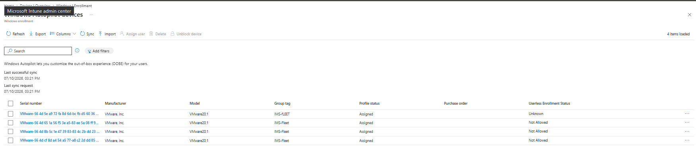

*Verification Log - the full pilot-plus-batch-1 fleet (staff01, supervisor01, itsadmin01, itsadmin02) reporting Compliant (primary-user column redacted):*

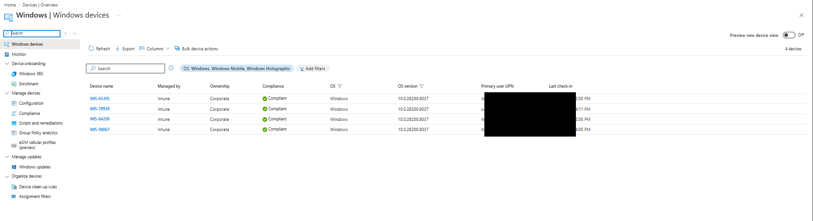

> **Field note - group tag casing:** One device's tag was entered as `IMS-fLEET`. It still joined the dynamic group and enrolled, because Entra dynamic-membership string-value comparison is case-insensitive (property names are not). The mismatch is cosmetic only; the tag is being normalized to `IMS-Fleet` for a tidy fleet view.

---

## Next

Batch 2 onward (supervisor02-03, staff02-06), then flipping CA-003 (require compliant device) from report-only to On once all 11 devices are enrolled and compliant.

---

*Last updated: July 2026*
