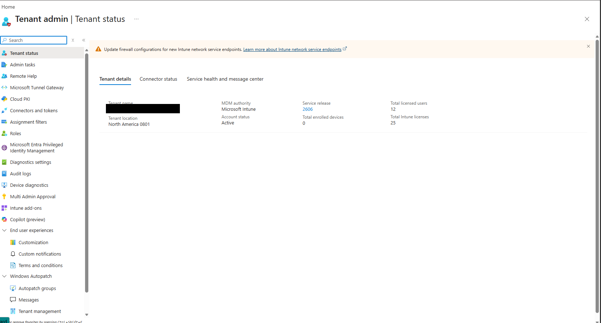
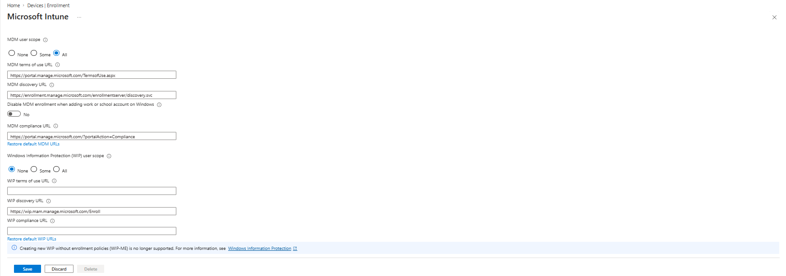
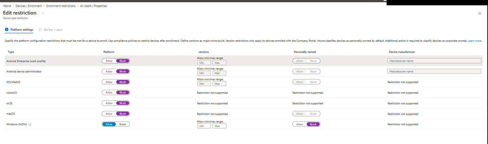
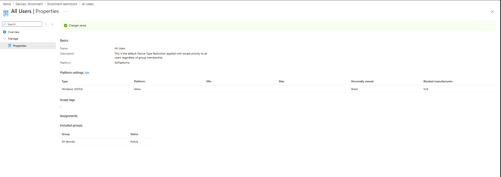

# Intune Enrollment Configuration

## Overview

Phase 3 begins with the enrollment layer — controlling *how* devices get into management before any policy is built. Order matters: enrollment rules first, compliance and configuration policies next, then actual device enrollment (Phase 4). Enrolling devices before the rules exist makes it impossible to tell which setting caused which behaviour.

---

## Tenant Baseline

Starting state verified before any changes:

| Setting | Value |
|---------|-------|
| MDM authority | Microsoft Intune (pre-set) |
| Account status | Active |
| Total licensed users | 12 (11 fleet users + tenant admin) |
| Total Intune licenses | 25 |
| Total enrolled devices | 0 |

*Verification Log — Intune tenant status confirmed before configuration:*

---

## MDM Automatic Enrollment

**Setting:** MDM user scope changed from `None` to `All`.

| Setting | Value |
|---------|-------|
| MDM user scope | **All** — every licensed user's device auto-enrolls at Entra join |
| WIP user scope | **None** — Windows Information Protection without enrollment is deprecated; left disabled |
| MDM URLs | Microsoft defaults, unchanged |

*Verification Log — MDM automatic enrollment configured with user scope All:*

> **Design Decision — MDM user scope All:** With the scope at None (the tenant default), a Windows device joining Entra ID is joined but *unmanaged* — it never enrolls in Intune, receives no compliance evaluation, and no configuration profiles. This default silently undermines the entire management design, so it is the first thing fixed.

---

## Device Platform Restriction

**Setting:** Default ("All Users") device type restriction edited.

| Platform | Decision | Reason |
|----------|----------|--------|
| Windows (MDM) | Allow, personally-owned **blocked** | Only corporate devices may enroll |
| Android (both types) | Block | Windows-only fleet; no mobile management in scope |
| iOS/iPadOS | Block | Same |
| macOS | Block | Same |
| visionOS / tvOS | Block | Same |

*Verification Log — platform restriction settings configured and saved:*

> **Design Decision — Block personally-owned Windows:** Intune classifies devices as personally-owned by default. Blocking them means a device must be registered as corporate — in this deployment, via Windows Autopilot hardware hash registration — before it can enroll. Consequence accepted: Autopilot registration becomes mandatory for every device, which is the intended onboarding path anyway. No side doors.

> **Design Decision — No OS version enforcement here:** The version fields in platform restrictions only apply to Company Portal enrollments; minimum OS is enforced in the compliance policy instead, where it applies to all enrollment types.

---

## Next

Windows 11 compliance policy — BitLocker, Secure Boot, TPM, Defender baseline, with a 3-day grace period before devices are marked noncompliant.

---

*Last updated: July 2026*
